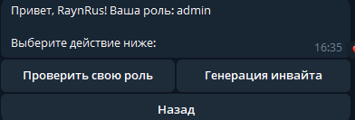
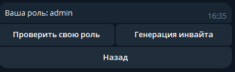
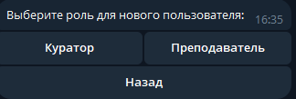
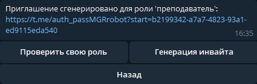
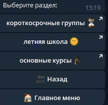
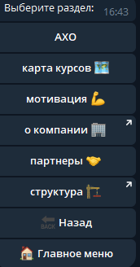

# Бот для аутсорсинга

## Как запустить бота?
    Выбрать файл main.py и запустить его
    После этого в боте прописать команду /start

## Скирншоты

### Проверка роли

### Генерация инвайта

### Документация преподавателя 

### Документация куратора

